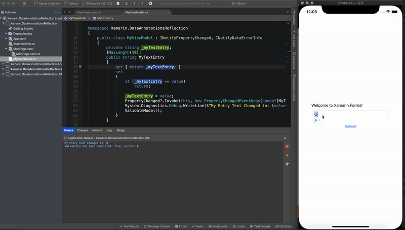

# xamarin-dataannotations-reflection

This examples demonstrates how you can use Xamarin.Forms together with Data Annotations validation:

```scharp
var context = new ValidationContext(this);
var valid = Validator.TryValidateObject(this, context, _validationErrors, true);
```

 It also shows how to access custom validation attributes manually if needed

```csharp
var model = this.BindingContext;
var props = model.GetType().GetProperties(BindingFlags.Public | BindingFlags.Instance);
var validationProps = props.Select(p => new { Property = p, ValidationAttribute = p.GetCustomAttribute<ValidationAttribute>() })
    .Where(p => p.ValidationAttribute != null)
    .ToList();

```

